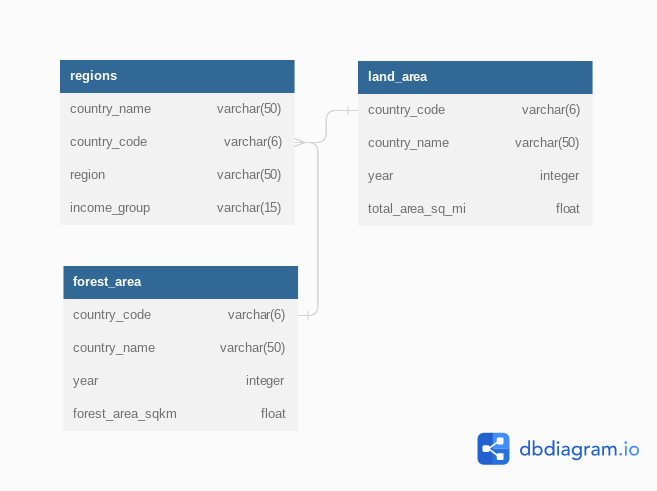

# QuerySense Report
## Global Deforestation, 1990 to 2016

Analysis of deforestation around the world to raise awareness about this crucial environmental topic

### How the data looks like


## Key Findings & Recommendations

> See [The Full Report](querysense-1990-2016-deforestation-report.pdf)

### Key Findings

1.  Between 1990 and 2016, the world lost 3.21% of its forest area, which is more than the size of Peru as of 2016 :cry:
2.  Within this period, the exact same regions ranked at the top and bottom of forest area size. Latin America & Caribbean maintained the highest global forest area though it witnessed a drop of 5% (from 51% to 46%). Conversely, the Middle East & North Africa remained the region with the lowest global forest area, though it's forest area increased by 0.29% (from 1.78% to 2.07%) :yawning_face:
3.  The only regions of the world that decreased in percent forest area from 1990 to 2016 were Latin America & Caribbean (dropped from 51.03 % to 46.16%) and Sub-Saharan Africa (30.67% to 28.79%). However, the drop in forest area in the two aforementioned regions was so large, the percent forest area of the world decreased over this period from 32.42% to 31.38%. :scream: :boom:
4.  The top two countries that increased in forest area are China and the U.S. :clap: :thumbsup: :sunglasses: :raised_hands:
5.  Brazil, Indonesia and Myanmar are the top 3 countries with the highest size of lost forest area :sweat:
6.  Togo, Nigeria and Uganda are the top 3 countries with the highest % of lost forest area :sweat:


### Recommendations

1.  The two regions with potentially the most impact on global forestation are Sub-Saharan Africa and Latin America & Caribbean. Focus more efforts here. :muscle:
2.  Countries in the high impact regions to focus more efforts include Brazil, Nigeria, Tanzania, Togo, Uganda, Mauritania and Honduras :pray:
3.  Nigeria is the only country that ranks in the top 5 both in terms of absolute square kilometer decrease in forest as well as percent decrease in forest area from 1990 to 2016. Therefore, this country has a significant opportunity ahead to stop the decline and hopefully spearhead remedial efforts. :sob: :crossed_fingers: :pray: 
4.  It would be great to study what drove the forest increase in China, the U.S, Iceland and French Polynesia, to see how it can be applied to the high risk and high impact countries listed in (2) :writing_hand: :brain:


### Appendix: SQL Queries Used
All the queries used for the analysis can be found in the [src folder](/src), but there's a snippet below to give an idea of how they look and are structured :

```sql
-- Question: How many countries had a percent forestation higher than the United States in 2016?
WITH t1 AS (
  SELECT (fa.forest_area_sqkm / (la.total_area_sq_mi * 2.59)) * 100 AS us_pct_forest
  FROM land_area la
  JOIN forest_area fa
       ON la.country_code = fa.country_code
       AND la.year = fa.year
  JOIN regions rg
       ON fa.country_code = rg.country_code
  WHERE la.year = 2016 AND fa.country_name = 'United States'
)
SELECT rg.country_name AS country,
       (fa.forest_area_sqkm / (la.total_area_sq_mi * 2.59)) * 100 AS pct_forest
FROM land_area la
JOIN forest_area fa
     ON la.country_code = fa.country_code
     AND la.year = fa.year
JOIN regions rg
     ON fa.country_code = rg.country_code
WHERE la.year = 2016
GROUP BY rg.country_name, fa.forest_area_sqkm, la.total_area_sq_mi
HAVING (fa.forest_area_sqkm / (la.total_area_sq_mi * 2.59)) * 100 > (SELECT * FROM t1)
ORDER BY pct_forest DESC;

-- U.S forestation in 2016 was 33.93%
-- Answer: There were 94 countries with higher % forestation than the U.S in 2016
```

They SQL files are:

1.  [src/part-0-prep.sql](src/part-0-prep.sql)
2.  [src/part-1-global-situation.sql](src/part-1-global-situation.sql)
3.  [src/part-2-regional-outlook.sql](src/part-2-regional-outlook.sql)
4.  [src/part-3-country-level-detail.sql](src/part-3-country-level-detail.sql)

### Shocker

One major thing I learnt was that the NTILE aggregate function (which can be used to calculate percentiles, as part of a window function) might not work as expected if treated literally

> NTILE function doesn't look at the values, it just looks at the number of rows.
> ---
> For example, if there're 101 rows in a table and you use NTILE(4), it will first 
check to see if 101 is divisible by 4. Since 101 divided by 4 is 25 remainder 1, 
each of the groups will have 25 rows, and the remainder will be added to the first 
group. Thus: group-1 26, grp-2 25, grp-3 25, grp-4 25
